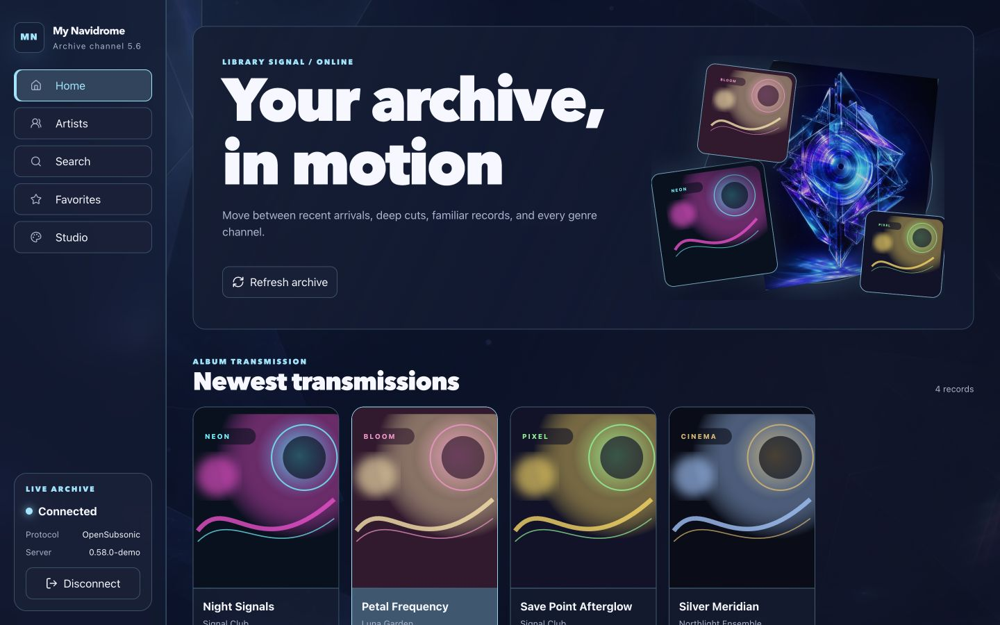
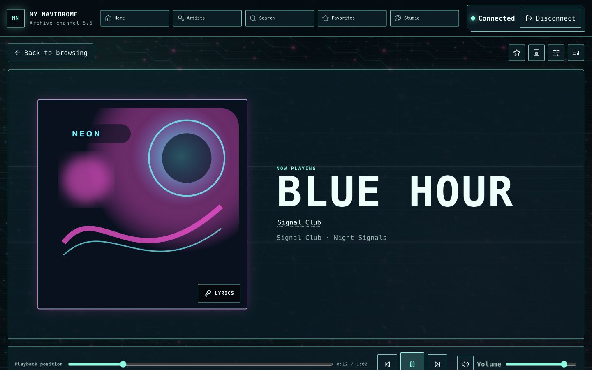
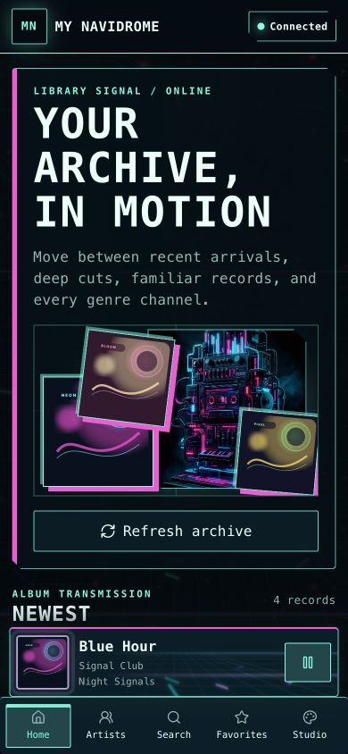
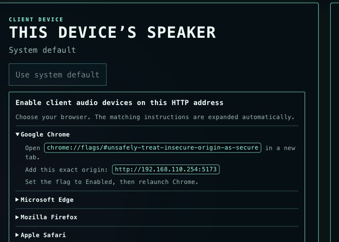

# Navidrome Hyperwave

**A cinematic, personality-driven Navidrome client for the web, macOS, and trusted local networks.**

**一个为 Web、macOS 与可信局域网打造的高能视觉化 Navidrome 客户端。**

[English](#english) · [中文](#中文)



## Screenshots / 页面预览

### Now Playing / 当前播放



<table>
  <tr>
    <td width="34%" valign="top">
      <strong>Mobile / 移动端</strong><br><br>
      
    </td>
    <td width="66%" valign="top">
      <strong>LAN audio routing / 局域网音频路由</strong><br><br>
      
    </td>
  </tr>
</table>

---

## English

### What is Navidrome Hyperwave?

Navidrome Hyperwave is an independent React client for a personal
[Navidrome](https://www.navidrome.org/) music server. It keeps the familiar library,
search, favorites, queue, and playback workflows, then lets the active track reshape
the entire interface through seven visual personalities.

The app can run as a browser client, a native macOS app, or a trusted-LAN web service
whose built-in renderer plays through the host Mac's CoreAudio devices.

### Highlights

- **Seven visual personalities** — Prism Archive, Neon Circuit, Soft Bloom,
  Pixel Quest, Riot Stage, Silver Screen, and Midnight Club each have a distinct
  layout, typography, artwork, transition language, and visualizer strategy.
- **A real now-playing page** — full-cover composition, transport controls, lyrics,
  output routing, queue access, equalizer, and stereo fusion.
- **Complete library browsing** — newest, random, frequent, genres, albums, artists,
  songs, search, and server-backed favorites.
- **Live visual response** — cover-art palette extraction plus spectrum, particles,
  hybrid, and off modes driven by a stable Web Audio graph.
- **Desktop and mobile layouts** — wide-screen stage compositions and a dedicated
  390px mobile shell with persistent navigation and a compact player.
- **Flexible playback destinations** — this browser, the system default device,
  a selected browser output, or the built-in server audio renderer.
- **Internal/external route switching** — save either or both Navidrome addresses;
  the app prefers the internal route, retries failed API and audio requests through
  the alternate route, and probes for a stable internal route while using external.
- **Network-aware bitrate control** — automatic mode keeps source quality internally
  and requests a 256 kbps transcode for high or unknown bitrate tracks externally;
  original, always-limited, and custom limit options are available in Audio & streaming.
- **OpenSubsonic-compatible authentication** — password token/salt authentication
  and API-key mode, without persisting passwords.
- **Accessible controls** — semantic navigation, visible focus, keyboard support,
  accessible icon names, and mobile-sized touch targets.

### Requirements

- A running Navidrome or compatible Subsonic/OpenSubsonic server
- Node.js 20 or newer
- npm
- For native macOS playback: a current macOS release and Xcode Command Line Tools

### Quick start

```bash
git clone https://github.com/deletoe/Navidrome-Hyperwave.git
cd Navidrome-Hyperwave
npm ci
npm run dev
```

Open [http://127.0.0.1:5173](http://127.0.0.1:5173), enter an internal Navidrome
address, an external address, or both, and sign in with a username/password or API key.
When both are configured, route changes are automatic: an internal failure is recovered
through external, while foreground external sessions probe internal with adaptive
15/30/60/120/300-second backoff and require two successful checks before switching back.

For other devices on a trusted local network:

```bash
npm run dev:lan
```

The terminal prints the available LAN URLs. Do not expose the development or output
server directly to the public internet.

### Native macOS app

```bash
npm run desktop:dev
```

Package an Apple Silicon build:

```bash
npm run desktop:package
```

See [docs/macos-app.md](docs/macos-app.md) for architecture and packaging details.

### Built-in LAN audio renderer

```bash
npm run output-server
```

The launcher builds the app, asks for the Navidrome connection, and prints a trusted-LAN
URL. The browser controls playback while the host Mac renders audio natively through
CoreAudio. Server credentials and authenticated stream URLs remain on the host.

See [docs/output-server.md](docs/output-server.md) for the complete threat model,
pairing behavior, and platform adapter notes.

### Browser audio devices on plain HTTP

Browsers restrict media-device discovery on ordinary LAN HTTP origins. The Audio Output
dialog detects this condition and shows the matching development override:

| Browser | Trusted-LAN development override |
| --- | --- |
| Chrome | Open `chrome://flags/#unsafely-treat-insecure-origin-as-secure`, add the exact origin, enable it, and relaunch |
| Edge | Open `edge://flags/#unsafely-treat-insecure-origin-as-secure`, add the exact origin, enable it, and relaunch |
| Firefox | In `about:config`, add the hostname to the String preference `dom.securecontext.allowlist`; Firefox applies it to every port on that hostname |
| Safari | No equivalent HTTP override; use HTTPS. In-page speaker selection requires Safari 18.4+ on macOS |

Only use these overrides for an address you trust. HTTPS is the correct production
solution.

### Commands

| Command | Purpose |
| --- | --- |
| `npm run dev` | Start the local web client and audio service |
| `npm run dev:web` | Start only the loopback Vite client |
| `npm run dev:lan` | Start the client on all LAN interfaces |
| `npm run desktop:dev` | Run the native macOS development app |
| `npm run output-server` | Build and start the trusted-LAN audio renderer |
| `npm run test:run` | Run the complete Vitest suite once |
| `npm run typecheck` | Run TypeScript project checks |
| `npm run build` | Build the production web bundle |
| `npm run desktop:package` | Build macOS DMG and ZIP artifacts |

### Architecture

| Layer | Technology and responsibility |
| --- | --- |
| UI | React 19, TypeScript, responsive CSS, Lucide icons |
| Web runtime | Vite 6, OpenSubsonic client, stable media URL resolution |
| Playback | One persistent media element, deterministic queue, fades, Media Session |
| Visual engine | Metadata theme selection, cover palette extraction, Canvas/Web Audio visualizers |
| Native host | Node.js service, Swift CoreAudio helpers, native macOS playback |
| Quality | Vitest, Testing Library, desktop/mobile browser verification |

### Privacy and security

- Passwords are held only in the active session and are not written to local storage.
- The LAN audio service keeps credentials and authenticated stream URLs on the host.
- Persistent visual and audio preferences are schema-checked and contain no library
  metadata, cover bytes, tokens, or passwords.
- Generated theme artwork contains no user library data.
- The standalone LAN server is intended only for a trusted network.

### Project documentation

- [Product plan](docs/product-plan.md)
- [Web verification notes](docs/verification.md)
- [macOS application](docs/macos-app.md)
- [LAN output server](docs/output-server.md)

---

## 中文

### Navidrome Hyperwave 是什么？

Navidrome Hyperwave 是一个面向个人音乐服务器的独立
[Navidrome](https://www.navidrome.org/) React 客户端。它保留曲库、搜索、收藏、
队列和播放等日常功能，同时让当前歌曲通过七套“视觉人格”重塑整个界面。

它既可以作为浏览器客户端运行，也可以作为 macOS 原生应用使用，还可以启动为可信
局域网 Web 服务，由服务器 Mac 的 CoreAudio 设备完成原生音频输出。

### 核心特色

- **七套视觉人格**：Prism Archive、Neon Circuit、Soft Bloom、Pixel Quest、
  Riot Stage、Silver Screen 与 Midnight Club 拥有各自的布局、字体、图像、
  转场语言和可视化策略。
- **真正的单曲播放页**：提供大幅封面构图、播放控制、歌词、音频路由、队列、
  均衡器与立体声融合。
- **完整曲库浏览**：支持最新、随机、常听、曲风、专辑、艺术家、歌曲、搜索和
  服务端收藏。
- **实时视觉响应**：从封面提取配色，并通过稳定的 Web Audio 链路驱动频谱、
  粒子、混合与关闭四种模式。
- **独立桌面与移动布局**：宽屏使用完整舞台构图，390px 手机界面拥有固定导航和
  紧凑播放器。
- **多种播放目标**：可使用当前浏览器、系统默认设备、浏览器指定设备或内置服务端
  音频渲染器。
- **OpenSubsonic 兼容鉴权**：支持密码 token/salt 与 API key，密码不会被持久化。
- **无障碍交互**：语义化导航、清晰焦点、键盘操作、图标可访问名称和移动端触控尺寸。

### 环境要求

- 正在运行的 Navidrome 或兼容 Subsonic/OpenSubsonic 的服务器
- Node.js 20 或更新版本
- npm
- 若使用 macOS 原生播放：当前 macOS 与 Xcode Command Line Tools

### 快速开始

```bash
git clone https://github.com/deletoe/Navidrome-Hyperwave.git
cd Navidrome-Hyperwave
npm ci
npm run dev
```

打开 [http://127.0.0.1:5173](http://127.0.0.1:5173)，填写 Navidrome
服务器地址，然后使用用户名/密码或 API key 登录。

若要让可信局域网中的其他设备访问：

```bash
npm run dev:lan
```

终端会打印可用的局域网地址。不要把开发服务器或音频输出服务直接暴露到公网。

### macOS 原生应用

```bash
npm run desktop:dev
```

构建 Apple Silicon 安装包：

```bash
npm run desktop:package
```

架构与打包细节请查看 [docs/macos-app.md](docs/macos-app.md)。

### 内置局域网音频渲染器

```bash
npm run output-server
```

启动器会先构建应用，再询问 Navidrome 连接信息并打印可信局域网地址。浏览器负责控制，
服务器 Mac 则通过 CoreAudio 原生播放；服务器凭据和带鉴权的音频流地址始终留在主机。

完整威胁模型、配对方式和平台适配说明请查看
[docs/output-server.md](docs/output-server.md)。

### 普通 HTTP 下的浏览器音频设备

浏览器会限制普通局域网 HTTP 来源的媒体设备枚举。音频输出页面检测到这种情况后，
会自动展开当前浏览器对应的开发配置：

| 浏览器 | 可信局域网开发配置 |
| --- | --- |
| Chrome | 打开 `chrome://flags/#unsafely-treat-insecure-origin-as-secure`，加入完整 origin，启用并重启 |
| Edge | 打开 `edge://flags/#unsafely-treat-insecure-origin-as-secure`，加入完整 origin，启用并重启 |
| Firefox | 在 `about:config` 中把主机名加入字符串设置 `dom.securecontext.allowlist`；它会作用于该主机的所有端口 |
| Safari | 没有等价的 HTTP 绕过设置；请使用 HTTPS。网页内扬声器选择要求 macOS Safari 18.4+ |

这些绕过设置只能用于你信任的地址。正式部署应当使用 HTTPS。

### 常用命令

| 命令 | 用途 |
| --- | --- |
| `npm run dev` | 启动本机 Web 客户端与音频服务 |
| `npm run dev:web` | 只启动回环地址上的 Vite 客户端 |
| `npm run dev:lan` | 在所有局域网接口启动客户端 |
| `npm run desktop:dev` | 运行 macOS 原生开发应用 |
| `npm run output-server` | 构建并启动可信局域网音频渲染器 |
| `npm run test:run` | 单次运行完整 Vitest 测试 |
| `npm run typecheck` | 执行 TypeScript 工程检查 |
| `npm run build` | 构建生产 Web 包 |
| `npm run desktop:package` | 构建 macOS DMG 与 ZIP |

### 技术架构

| 层级 | 技术与职责 |
| --- | --- |
| 界面 | React 19、TypeScript、响应式 CSS、Lucide 图标 |
| Web 运行时 | Vite 6、OpenSubsonic 客户端、稳定媒体 URL |
| 播放 | 单一稳定媒体节点、确定性队列、渐入渐出、Media Session |
| 视觉引擎 | 元数据主题判定、封面取色、Canvas/Web Audio 可视化 |
| 原生主机 | Node.js 服务、Swift CoreAudio 辅助程序、macOS 原生播放 |
| 质量保障 | Vitest、Testing Library、桌面与移动浏览器验证 |

### 隐私与安全

- 密码只存在于当前会话，不写入 localStorage。
- 局域网音频服务会把服务器凭据和鉴权音频地址保留在主机。
- 持久化的视觉与音频偏好经过结构校验，不含曲库元数据、封面字节、token 或密码。
- 生成的主题图像不包含用户曲库数据。
- 独立局域网服务只适用于可信网络。

### 项目文档

- [产品计划](docs/product-plan.md)
- [Web 验证记录](docs/verification.md)
- [macOS 应用说明](docs/macos-app.md)
- [局域网音频服务](docs/output-server.md)
